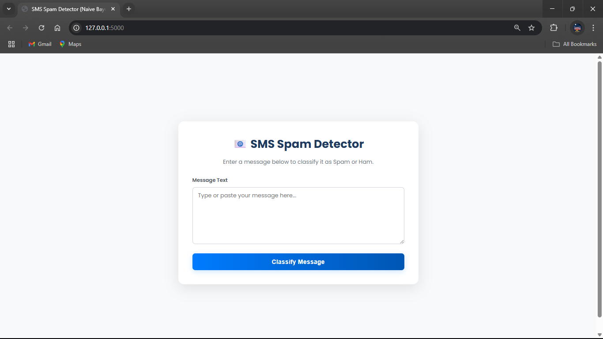
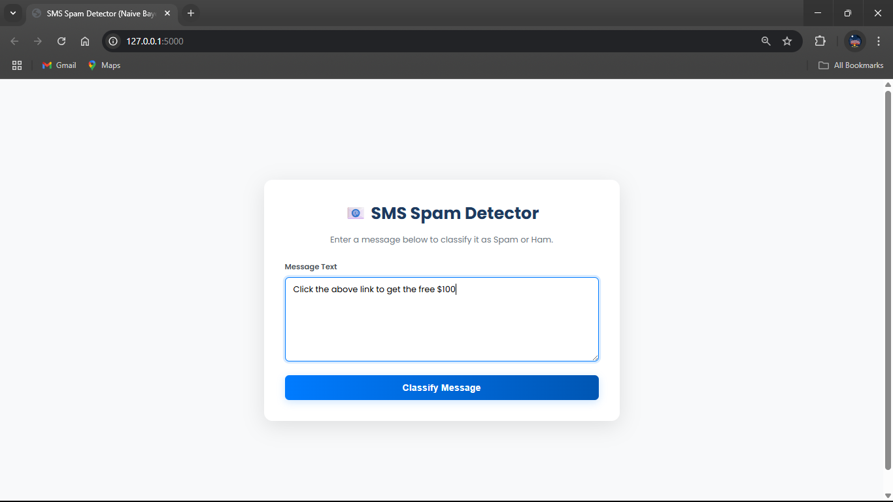
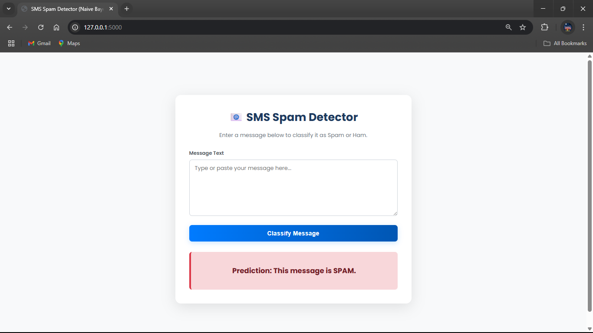

-----

# Spam Detector Web App using Multinomial Naive Bayes 

This project implements a spam detector using a **Multinomial Naive Bayes** classifier. It is deployed as a simple web application using Flask, where users can enter a text message and get a prediction on whether it is "Spam" or "Not Spam" (Ham).

The model is trained on a dataset of SMS messages and uses a `CountVectorizer` to convert text data into a numerical format suitable for the Naive Bayes algorithm.

-----

## Files Description

  * **`Spam Detector.ipynb`**: A Jupyter Notebook that walks through the entire process of creating the model. It includes data loading, text preprocessing, feature extraction using `CountVectorizer`, training the Multinomial Naive Bayes model, and evaluating its accuracy.
  * **`app.py`**: The backend of the web application. This Flask script loads the pre-trained model and vectorizer, handles user requests from the web page, and returns the classification result.
  * **`model.pkl`**: The saved, pre-trained Multinomial Naive Bayes classifier.
  * **`vectorizer.pkl`**: The saved `CountVectorizer` object. This is crucial for transforming new, user-submitted text in the exact same way the original training data was transformed.
  * **`spam.csv`**: The dataset containing labeled SMS messages used to train and test the model.
  * **`templates/home.html`**: The HTML file that creates the simple user interface for the web application, including the text input form and the area to display the result.
```
Multinomial_Naive_Bayes Spam_Detector_App/
├── Spam_Detector_app.py
├── spam.csv
│
├── templates/
│   └── index.html
│
└── static/
    └── css/
        └── style.css
```

-----

## How to Run the Project

You can either run the final web application directly or explore the model creation process in the Jupyter Notebook.

### Part A: Running the Flask Web App

Follow these steps to run the user-facing spam detector application.

#### 1\. Get the Project Files

Download the project files to your local machine.

```bash
# Use svn to export just this folder
svn export https://github.com/SURESH6161/Data-Science/trunk/Supervised/Multinomial_Naive_Bayes%20Spam_Detector_Appa

# Navigate into the new directory
cd Multinomial_Naive_Bayes Spam_Detector_Appa
```

*(Alternatively, you can download the entire repository as a ZIP file from GitHub and navigate to this folder).*

#### 2\. Create a Virtual Environment (Recommended)

This keeps your project dependencies clean and isolated.

```bash
# Create the environment
python -m venv venv

# Activate the environment
# On Windows:
venv\Scripts\activate
# On macOS/Linux:
source venv/bin/activate
```

#### 3\. Install Dependencies

Create a file named `requirements.txt` in the project directory with the following content:

**`requirements.txt`**:

```
Flask
scikit-learn
pandas
numpy
```

Now, install all the required libraries with one command:

```bash
pip install -r requirements.txt
```

#### 4\. Run the Application

Start the Flask server by running the `app.py` file.

```bash
python app.py
```

#### 5\. View in Browser

Open your web browser and navigate to the following URL:

**[http://127.0.0.1:5000](https://www.google.com/search?q=http://127.0.0.1:5000)**

You can now enter any message into the text box to see if the model classifies it as spam.

-----

### Part B: Exploring the Jupyter Notebook

If you want to understand how the model was built, you can run the Jupyter Notebook.

1.  **Ensure you have Jupyter installed**. If not, add `notebook` to your `requirements.txt` file and run `pip install -r requirements.txt` again.
2.  **Launch Jupyter Notebook** from your terminal (make sure your virtual environment is still active):
    ```bash
    jupyter notebook
    ```
3.  **Open the notebook**. In the browser tab that opens, click on `Spam Detector.ipynb` to view and run the code cells.

-----

## Screenshot

## Step 1

## Step 2

## Step 3


-----

## Disclaimer

This project is created for educational and demonstration purposes only. The model's accuracy is dependent on the dataset it was trained on, and it should not be used for any critical commercial or production applications.
